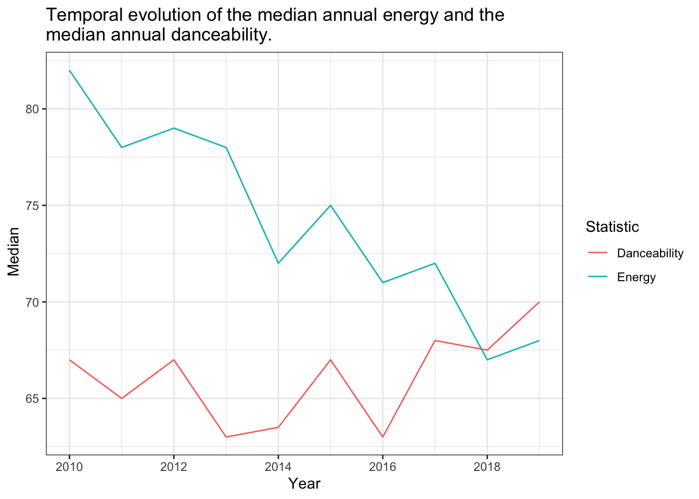

::: {.cell}

:::


## Exercise 1


::: {.cell}

:::


### Q1


::: {.cell}

:::


The data set contains 584 songs, 184 artists, and 50 musical genres.


### Q2


::: {.cell}
::: {.cell-output-display}

`````{=html}
<table>
<caption>Number of songs on the spotify top song charts per year</caption>
 <thead>
  <tr>
   <th style="text-align:center;"> Year </th>
   <th style="text-align:right;"> Number of songs </th>
  </tr>
 </thead>
<tbody>
  <tr>
   <td style="text-align:center;"> 2010 </td>
   <td style="text-align:right;"> 51 </td>
  </tr>
  <tr>
   <td style="text-align:center;"> 2011 </td>
   <td style="text-align:right;"> 53 </td>
  </tr>
  <tr>
   <td style="text-align:center;"> 2012 </td>
   <td style="text-align:right;"> 35 </td>
  </tr>
  <tr>
   <td style="text-align:center;"> 2013 </td>
   <td style="text-align:right;"> 71 </td>
  </tr>
  <tr>
   <td style="text-align:center;"> 2014 </td>
   <td style="text-align:right;"> 58 </td>
  </tr>
  <tr>
   <td style="text-align:center;"> 2015 </td>
   <td style="text-align:right;"> 95 </td>
  </tr>
  <tr>
   <td style="text-align:center;"> 2016 </td>
   <td style="text-align:right;"> 80 </td>
  </tr>
  <tr>
   <td style="text-align:center;"> 2017 </td>
   <td style="text-align:right;"> 65 </td>
  </tr>
  <tr>
   <td style="text-align:center;"> 2018 </td>
   <td style="text-align:right;"> 64 </td>
  </tr>
  <tr>
   <td style="text-align:center;"> 2019 </td>
   <td style="text-align:right;"> 31 </td>
  </tr>
</tbody>
</table>

`````

:::
:::


### Q3


::: {.cell}

:::


The most popular artist is Katy Perry, with 17 individual songs on the spotify top song charts.


### Q4


::: {.cell}
::: {.cell-output-display}

`````{=html}
<table>
<caption>Minimum, maximum, mean and median bpm for each musical genre</caption>
 <thead>
<tr>
<th style="empty-cells: hide;border-bottom:hidden;" colspan="1"></th>
<th style="border-bottom:hidden;padding-bottom:0; padding-left:3px;padding-right:3px;text-align: center; " colspan="4"><div style="border-bottom: 1px solid #ddd; padding-bottom: 5px; ">bpm</div></th>
<th style="empty-cells: hide;border-bottom:hidden;" colspan="1"></th>
</tr>
  <tr>
   <th style="text-align:left;"> Musical genre </th>
   <th style="text-align:center;"> Minimum </th>
   <th style="text-align:center;"> Maximum </th>
   <th style="text-align:center;"> Mean </th>
   <th style="text-align:center;"> Median </th>
   <th style="text-align:center;"> Number of songs </th>
  </tr>
 </thead>
<tbody>
  <tr>
   <td style="text-align:left;"> acoustic pop </td>
   <td style="text-align:center;"> 125 </td>
   <td style="text-align:center;"> 185 </td>
   <td style="text-align:center;"> 155 </td>
   <td style="text-align:center;"> 155 </td>
   <td style="text-align:center;"> 2 </td>
  </tr>
  <tr>
   <td style="text-align:left;"> alaska indie </td>
   <td style="text-align:center;"> 132 </td>
   <td style="text-align:center;"> 132 </td>
   <td style="text-align:center;"> 132 </td>
   <td style="text-align:center;"> 132 </td>
   <td style="text-align:center;"> 1 </td>
  </tr>
  <tr>
   <td style="text-align:left;"> alternative r&amp;b </td>
   <td style="text-align:center;"> 136 </td>
   <td style="text-align:center;"> 136 </td>
   <td style="text-align:center;"> 136 </td>
   <td style="text-align:center;"> 136 </td>
   <td style="text-align:center;"> 1 </td>
  </tr>
  <tr>
   <td style="text-align:left;"> art pop </td>
   <td style="text-align:center;"> 94 </td>
   <td style="text-align:center;"> 150 </td>
   <td style="text-align:center;"> 115 </td>
   <td style="text-align:center;"> 108 </td>
   <td style="text-align:center;"> 8 </td>
  </tr>
  <tr>
   <td style="text-align:left;"> atl hip hop </td>
   <td style="text-align:center;"> 80 </td>
   <td style="text-align:center;"> 130 </td>
   <td style="text-align:center;"> 108 </td>
   <td style="text-align:center;"> 112 </td>
   <td style="text-align:center;"> 4 </td>
  </tr>
  <tr>
   <td style="text-align:left;"> australian dance </td>
   <td style="text-align:center;"> 87 </td>
   <td style="text-align:center;"> 192 </td>
   <td style="text-align:center;"> 129 </td>
   <td style="text-align:center;"> 115 </td>
   <td style="text-align:center;"> 6 </td>
  </tr>
  <tr>
   <td style="text-align:left;"> australian hip hop </td>
   <td style="text-align:center;"> 95 </td>
   <td style="text-align:center;"> 95 </td>
   <td style="text-align:center;"> 95 </td>
   <td style="text-align:center;"> 95 </td>
   <td style="text-align:center;"> 1 </td>
  </tr>
  <tr>
   <td style="text-align:left;"> australian pop </td>
   <td style="text-align:center;"> 127 </td>
   <td style="text-align:center;"> 186 </td>
   <td style="text-align:center;"> 154 </td>
   <td style="text-align:center;"> 150 </td>
   <td style="text-align:center;"> 5 </td>
  </tr>
  <tr>
   <td style="text-align:left;"> barbadian pop </td>
   <td style="text-align:center;"> 78 </td>
   <td style="text-align:center;"> 206 </td>
   <td style="text-align:center;"> 125 </td>
   <td style="text-align:center;"> 127 </td>
   <td style="text-align:center;"> 15 </td>
  </tr>
  <tr>
   <td style="text-align:left;"> baroque pop </td>
   <td style="text-align:center;"> 108 </td>
   <td style="text-align:center;"> 184 </td>
   <td style="text-align:center;"> 146 </td>
   <td style="text-align:center;"> 146 </td>
   <td style="text-align:center;"> 2 </td>
  </tr>
  <tr>
   <td style="text-align:left;"> belgian edm </td>
   <td style="text-align:center;"> 122 </td>
   <td style="text-align:center;"> 122 </td>
   <td style="text-align:center;"> 122 </td>
   <td style="text-align:center;"> 122 </td>
   <td style="text-align:center;"> 2 </td>
  </tr>
  <tr>
   <td style="text-align:left;"> big room </td>
   <td style="text-align:center;"> 106 </td>
   <td style="text-align:center;"> 134 </td>
   <td style="text-align:center;"> 122 </td>
   <td style="text-align:center;"> 125 </td>
   <td style="text-align:center;"> 10 </td>
  </tr>
  <tr>
   <td style="text-align:left;"> boy band </td>
   <td style="text-align:center;"> 77 </td>
   <td style="text-align:center;"> 160 </td>
   <td style="text-align:center;"> 116 </td>
   <td style="text-align:center;"> 120 </td>
   <td style="text-align:center;"> 15 </td>
  </tr>
  <tr>
   <td style="text-align:left;"> british soul </td>
   <td style="text-align:center;"> 0 </td>
   <td style="text-align:center;"> 164 </td>
   <td style="text-align:center;"> 109 </td>
   <td style="text-align:center;"> 108 </td>
   <td style="text-align:center;"> 9 </td>
  </tr>
  <tr>
   <td style="text-align:left;"> brostep </td>
   <td style="text-align:center;"> 100 </td>
   <td style="text-align:center;"> 142 </td>
   <td style="text-align:center;"> 121 </td>
   <td style="text-align:center;"> 121 </td>
   <td style="text-align:center;"> 2 </td>
  </tr>
  <tr>
   <td style="text-align:left;"> canadian contemporary r&amp;b </td>
   <td style="text-align:center;"> 93 </td>
   <td style="text-align:center;"> 186 </td>
   <td style="text-align:center;"> 130 </td>
   <td style="text-align:center;"> 120 </td>
   <td style="text-align:center;"> 7 </td>
  </tr>
  <tr>
   <td style="text-align:left;"> canadian hip hop </td>
   <td style="text-align:center;"> 100 </td>
   <td style="text-align:center;"> 118 </td>
   <td style="text-align:center;"> 109 </td>
   <td style="text-align:center;"> 109 </td>
   <td style="text-align:center;"> 2 </td>
  </tr>
  <tr>
   <td style="text-align:left;"> canadian latin </td>
   <td style="text-align:center;"> 98 </td>
   <td style="text-align:center;"> 98 </td>
   <td style="text-align:center;"> 98 </td>
   <td style="text-align:center;"> 98 </td>
   <td style="text-align:center;"> 1 </td>
  </tr>
  <tr>
   <td style="text-align:left;"> canadian pop </td>
   <td style="text-align:center;"> 65 </td>
   <td style="text-align:center;"> 192 </td>
   <td style="text-align:center;"> 122 </td>
   <td style="text-align:center;"> 119 </td>
   <td style="text-align:center;"> 31 </td>
  </tr>
  <tr>
   <td style="text-align:left;"> candy pop </td>
   <td style="text-align:center;"> 92 </td>
   <td style="text-align:center;"> 126 </td>
   <td style="text-align:center;"> 109 </td>
   <td style="text-align:center;"> 109 </td>
   <td style="text-align:center;"> 2 </td>
  </tr>
  <tr>
   <td style="text-align:left;"> celtic rock </td>
   <td style="text-align:center;"> 85 </td>
   <td style="text-align:center;"> 85 </td>
   <td style="text-align:center;"> 85 </td>
   <td style="text-align:center;"> 85 </td>
   <td style="text-align:center;"> 1 </td>
  </tr>
  <tr>
   <td style="text-align:left;"> chicago rap </td>
   <td style="text-align:center;"> 125 </td>
   <td style="text-align:center;"> 125 </td>
   <td style="text-align:center;"> 125 </td>
   <td style="text-align:center;"> 125 </td>
   <td style="text-align:center;"> 1 </td>
  </tr>
  <tr>
   <td style="text-align:left;"> colombian pop </td>
   <td style="text-align:center;"> 112 </td>
   <td style="text-align:center;"> 138 </td>
   <td style="text-align:center;"> 126 </td>
   <td style="text-align:center;"> 128 </td>
   <td style="text-align:center;"> 3 </td>
  </tr>
  <tr>
   <td style="text-align:left;"> complextro </td>
   <td style="text-align:center;"> 102 </td>
   <td style="text-align:center;"> 130 </td>
   <td style="text-align:center;"> 120 </td>
   <td style="text-align:center;"> 127 </td>
   <td style="text-align:center;"> 6 </td>
  </tr>
  <tr>
   <td style="text-align:left;"> contemporary country </td>
   <td style="text-align:center;"> 86 </td>
   <td style="text-align:center;"> 86 </td>
   <td style="text-align:center;"> 86 </td>
   <td style="text-align:center;"> 86 </td>
   <td style="text-align:center;"> 1 </td>
  </tr>
  <tr>
   <td style="text-align:left;"> dance pop </td>
   <td style="text-align:center;"> 43 </td>
   <td style="text-align:center;"> 202 </td>
   <td style="text-align:center;"> 119 </td>
   <td style="text-align:center;"> 120 </td>
   <td style="text-align:center;"> 323 </td>
  </tr>
  <tr>
   <td style="text-align:left;"> danish pop </td>
   <td style="text-align:center;"> 120 </td>
   <td style="text-align:center;"> 120 </td>
   <td style="text-align:center;"> 120 </td>
   <td style="text-align:center;"> 120 </td>
   <td style="text-align:center;"> 1 </td>
  </tr>
  <tr>
   <td style="text-align:left;"> detroit hip hop </td>
   <td style="text-align:center;"> 82 </td>
   <td style="text-align:center;"> 87 </td>
   <td style="text-align:center;"> 84 </td>
   <td style="text-align:center;"> 84 </td>
   <td style="text-align:center;"> 2 </td>
  </tr>
  <tr>
   <td style="text-align:left;"> downtempo </td>
   <td style="text-align:center;"> 100 </td>
   <td style="text-align:center;"> 167 </td>
   <td style="text-align:center;"> 134 </td>
   <td style="text-align:center;"> 134 </td>
   <td style="text-align:center;"> 2 </td>
  </tr>
  <tr>
   <td style="text-align:left;"> edm </td>
   <td style="text-align:center;"> 90 </td>
   <td style="text-align:center;"> 118 </td>
   <td style="text-align:center;"> 103 </td>
   <td style="text-align:center;"> 102 </td>
   <td style="text-align:center;"> 4 </td>
  </tr>
  <tr>
   <td style="text-align:left;"> electro </td>
   <td style="text-align:center;"> 100 </td>
   <td style="text-align:center;"> 116 </td>
   <td style="text-align:center;"> 108 </td>
   <td style="text-align:center;"> 108 </td>
   <td style="text-align:center;"> 2 </td>
  </tr>
  <tr>
   <td style="text-align:left;"> electro house </td>
   <td style="text-align:center;"> 124 </td>
   <td style="text-align:center;"> 124 </td>
   <td style="text-align:center;"> 124 </td>
   <td style="text-align:center;"> 124 </td>
   <td style="text-align:center;"> 1 </td>
  </tr>
  <tr>
   <td style="text-align:left;"> electronic trap </td>
   <td style="text-align:center;"> 96 </td>
   <td style="text-align:center;"> 100 </td>
   <td style="text-align:center;"> 98 </td>
   <td style="text-align:center;"> 98 </td>
   <td style="text-align:center;"> 2 </td>
  </tr>
  <tr>
   <td style="text-align:left;"> electropop </td>
   <td style="text-align:center;"> 90 </td>
   <td style="text-align:center;"> 160 </td>
   <td style="text-align:center;"> 113 </td>
   <td style="text-align:center;"> 103 </td>
   <td style="text-align:center;"> 13 </td>
  </tr>
  <tr>
   <td style="text-align:left;"> escape room </td>
   <td style="text-align:center;"> 96 </td>
   <td style="text-align:center;"> 158 </td>
   <td style="text-align:center;"> 127 </td>
   <td style="text-align:center;"> 127 </td>
   <td style="text-align:center;"> 2 </td>
  </tr>
  <tr>
   <td style="text-align:left;"> folk-pop </td>
   <td style="text-align:center;"> 75 </td>
   <td style="text-align:center;"> 86 </td>
   <td style="text-align:center;"> 80 </td>
   <td style="text-align:center;"> 80 </td>
   <td style="text-align:center;"> 2 </td>
  </tr>
  <tr>
   <td style="text-align:left;"> french indie pop </td>
   <td style="text-align:center;"> 123 </td>
   <td style="text-align:center;"> 123 </td>
   <td style="text-align:center;"> 123 </td>
   <td style="text-align:center;"> 123 </td>
   <td style="text-align:center;"> 1 </td>
  </tr>
  <tr>
   <td style="text-align:left;"> hip hop </td>
   <td style="text-align:center;"> 80 </td>
   <td style="text-align:center;"> 112 </td>
   <td style="text-align:center;"> 94 </td>
   <td style="text-align:center;"> 92 </td>
   <td style="text-align:center;"> 4 </td>
  </tr>
  <tr>
   <td style="text-align:left;"> hip pop </td>
   <td style="text-align:center;"> 93 </td>
   <td style="text-align:center;"> 111 </td>
   <td style="text-align:center;"> 101 </td>
   <td style="text-align:center;"> 98 </td>
   <td style="text-align:center;"> 6 </td>
  </tr>
  <tr>
   <td style="text-align:left;"> hollywood </td>
   <td style="text-align:center;"> 92 </td>
   <td style="text-align:center;"> 92 </td>
   <td style="text-align:center;"> 92 </td>
   <td style="text-align:center;"> 92 </td>
   <td style="text-align:center;"> 1 </td>
  </tr>
  <tr>
   <td style="text-align:left;"> house </td>
   <td style="text-align:center;"> 122 </td>
   <td style="text-align:center;"> 122 </td>
   <td style="text-align:center;"> 122 </td>
   <td style="text-align:center;"> 122 </td>
   <td style="text-align:center;"> 1 </td>
  </tr>
  <tr>
   <td style="text-align:left;"> indie pop </td>
   <td style="text-align:center;"> 148 </td>
   <td style="text-align:center;"> 155 </td>
   <td style="text-align:center;"> 152 </td>
   <td style="text-align:center;"> 152 </td>
   <td style="text-align:center;"> 2 </td>
  </tr>
  <tr>
   <td style="text-align:left;"> irish singer-songwriter </td>
   <td style="text-align:center;"> 129 </td>
   <td style="text-align:center;"> 129 </td>
   <td style="text-align:center;"> 129 </td>
   <td style="text-align:center;"> 129 </td>
   <td style="text-align:center;"> 1 </td>
  </tr>
  <tr>
   <td style="text-align:left;"> latin </td>
   <td style="text-align:center;"> 94 </td>
   <td style="text-align:center;"> 186 </td>
   <td style="text-align:center;"> 141 </td>
   <td style="text-align:center;"> 142 </td>
   <td style="text-align:center;"> 4 </td>
  </tr>
  <tr>
   <td style="text-align:left;"> metropopolis </td>
   <td style="text-align:center;"> 127 </td>
   <td style="text-align:center;"> 127 </td>
   <td style="text-align:center;"> 127 </td>
   <td style="text-align:center;"> 127 </td>
   <td style="text-align:center;"> 1 </td>
  </tr>
  <tr>
   <td style="text-align:left;"> moroccan pop </td>
   <td style="text-align:center;"> 110 </td>
   <td style="text-align:center;"> 110 </td>
   <td style="text-align:center;"> 110 </td>
   <td style="text-align:center;"> 110 </td>
   <td style="text-align:center;"> 1 </td>
  </tr>
  <tr>
   <td style="text-align:left;"> neo mellow </td>
   <td style="text-align:center;"> 76 </td>
   <td style="text-align:center;"> 138 </td>
   <td style="text-align:center;"> 109 </td>
   <td style="text-align:center;"> 116 </td>
   <td style="text-align:center;"> 9 </td>
  </tr>
  <tr>
   <td style="text-align:left;"> permanent wave </td>
   <td style="text-align:center;"> 125 </td>
   <td style="text-align:center;"> 148 </td>
   <td style="text-align:center;"> 137 </td>
   <td style="text-align:center;"> 138 </td>
   <td style="text-align:center;"> 4 </td>
  </tr>
  <tr>
   <td style="text-align:left;"> pop </td>
   <td style="text-align:center;"> 77 </td>
   <td style="text-align:center;"> 190 </td>
   <td style="text-align:center;"> 117 </td>
   <td style="text-align:center;"> 116 </td>
   <td style="text-align:center;"> 55 </td>
  </tr>
  <tr>
   <td style="text-align:left;"> tropical house </td>
   <td style="text-align:center;"> 120 </td>
   <td style="text-align:center;"> 139 </td>
   <td style="text-align:center;"> 130 </td>
   <td style="text-align:center;"> 130 </td>
   <td style="text-align:center;"> 2 </td>
  </tr>
</tbody>
</table>

`````

:::
:::


### Q5


::: {.cell}

:::

A data frame including the median energy and the median danceability per year.


### Q6


::: {.cell}

:::

::: {.cell}
::: {.cell-output-display}
{width=672}
:::
:::


## Exercise 2


::: {.cell}

:::


### Q1


::: {.cell}

:::

A data frame including the median Age at enrollment, conditioned both on the Gender and on the Marital status.
  


### Q2
  

::: {.cell}
::: {.cell-output-display}

`````{=html}
<table>
<caption>Median age at enrollment by marital status and gender</caption>
 <thead>
<tr>
<th style="empty-cells: hide;border-bottom:hidden;" colspan="1"></th>
<th style="border-bottom:hidden;padding-bottom:0; padding-left:3px;padding-right:3px;text-align: center; " colspan="2"><div style="border-bottom: 1px solid #ddd; padding-bottom: 5px; ">Gender</div></th>
</tr>
  <tr>
   <th style="text-align:left;"> Marital status </th>
   <th style="text-align:center;"> Male </th>
   <th style="text-align:center;"> Female </th>
  </tr>
 </thead>
<tbody>
  <tr>
   <td style="text-align:left;"> single </td>
   <td style="text-align:center;"> 20 </td>
   <td style="text-align:center;"> 19 </td>
  </tr>
  <tr>
   <td style="text-align:left;"> married </td>
   <td style="text-align:center;"> 37 </td>
   <td style="text-align:center;"> 34 </td>
  </tr>
  <tr>
   <td style="text-align:left;"> divorced </td>
   <td style="text-align:center;"> 40 </td>
   <td style="text-align:center;"> 38 </td>
  </tr>
  <tr>
   <td style="text-align:left;"> widower </td>
   <td style="text-align:center;"> 43 </td>
   <td style="text-align:center;"> 21 </td>
  </tr>
  <tr>
   <td style="text-align:left;"> facto union </td>
   <td style="text-align:center;"> 34 </td>
   <td style="text-align:center;"> 27 </td>
  </tr>
  <tr>
   <td style="text-align:left;"> legally separated </td>
   <td style="text-align:center;"> 55 </td>
   <td style="text-align:center;"> 41 </td>
  </tr>
</tbody>
</table>

`````

:::
:::


### Q3


::: {.cell}

:::

A data frame including the conditional mean of all variables related to Curricular units, given the value of the Target variable.


### Q4


::: {.cell}
::: {.cell-output-display}

`````{=html}
<table>
<caption>Mean curricular units per target</caption>
 <thead>
  <tr>
   <th style="text-align:left;"> Units </th>
   <th style="text-align:center;"> Dropout </th>
   <th style="text-align:center;"> Graduate </th>
   <th style="text-align:center;"> Enrolled </th>
  </tr>
 </thead>
<tbody>
  <tr>
   <td style="text-align:left;"> Curricular units 1st sem (credited) </td>
   <td style="text-align:center;"> 0.61 </td>
   <td style="text-align:center;"> 0.85 </td>
   <td style="text-align:center;"> 0.51 </td>
  </tr>
  <tr>
   <td style="text-align:left;"> Curricular units 1st sem (enrolled) </td>
   <td style="text-align:center;"> 5.82 </td>
   <td style="text-align:center;"> 6.67 </td>
   <td style="text-align:center;"> 5.96 </td>
  </tr>
  <tr>
   <td style="text-align:left;"> Curricular units 1st sem (evaluations) </td>
   <td style="text-align:center;"> 7.75 </td>
   <td style="text-align:center;"> 8.28 </td>
   <td style="text-align:center;"> 9.34 </td>
  </tr>
  <tr>
   <td style="text-align:left;"> Curricular units 1st sem (approved) </td>
   <td style="text-align:center;"> 2.55 </td>
   <td style="text-align:center;"> 6.23 </td>
   <td style="text-align:center;"> 4.32 </td>
  </tr>
  <tr>
   <td style="text-align:left;"> Curricular units 1st sem (grade) </td>
   <td style="text-align:center;"> 7.26 </td>
   <td style="text-align:center;"> 12.64 </td>
   <td style="text-align:center;"> 11.13 </td>
  </tr>
  <tr>
   <td style="text-align:left;"> Curricular units 1st sem (without evaluations) </td>
   <td style="text-align:center;"> 0.19 </td>
   <td style="text-align:center;"> 0.09 </td>
   <td style="text-align:center;"> 0.18 </td>
  </tr>
  <tr>
   <td style="text-align:left;"> Curricular units 2nd sem (credited) </td>
   <td style="text-align:center;"> 0.45 </td>
   <td style="text-align:center;"> 0.67 </td>
   <td style="text-align:center;"> 0.36 </td>
  </tr>
  <tr>
   <td style="text-align:left;"> Curricular units 2nd sem (enrolled) </td>
   <td style="text-align:center;"> 5.78 </td>
   <td style="text-align:center;"> 6.63 </td>
   <td style="text-align:center;"> 5.94 </td>
  </tr>
  <tr>
   <td style="text-align:left;"> Curricular units 2nd sem (evaluations) </td>
   <td style="text-align:center;"> 7.17 </td>
   <td style="text-align:center;"> 8.14 </td>
   <td style="text-align:center;"> 9.44 </td>
  </tr>
  <tr>
   <td style="text-align:left;"> Curricular units 2nd sem (approved) </td>
   <td style="text-align:center;"> 1.94 </td>
   <td style="text-align:center;"> 6.18 </td>
   <td style="text-align:center;"> 4.06 </td>
  </tr>
  <tr>
   <td style="text-align:left;"> Curricular units 2nd sem (grade) </td>
   <td style="text-align:center;"> 5.90 </td>
   <td style="text-align:center;"> 12.70 </td>
   <td style="text-align:center;"> 11.12 </td>
  </tr>
  <tr>
   <td style="text-align:left;"> Curricular units 2nd sem (without evaluations) </td>
   <td style="text-align:center;"> 0.24 </td>
   <td style="text-align:center;"> 0.08 </td>
   <td style="text-align:center;"> 0.19 </td>
  </tr>
</tbody>
</table>

`````

:::
:::